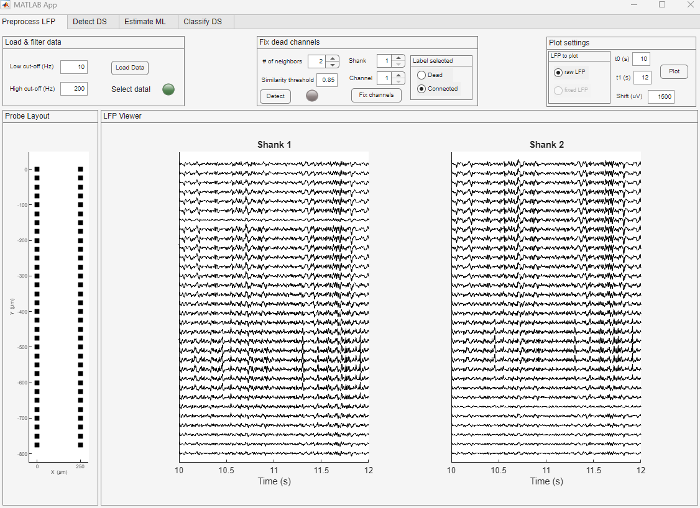
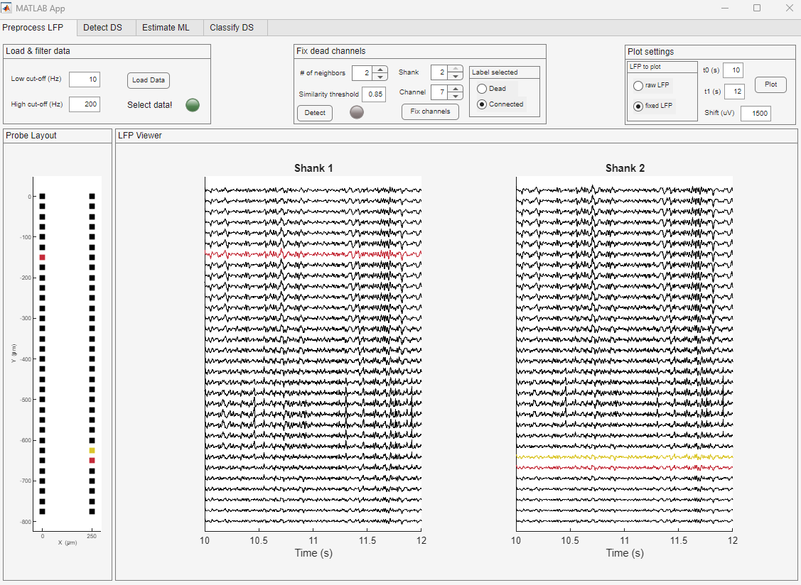
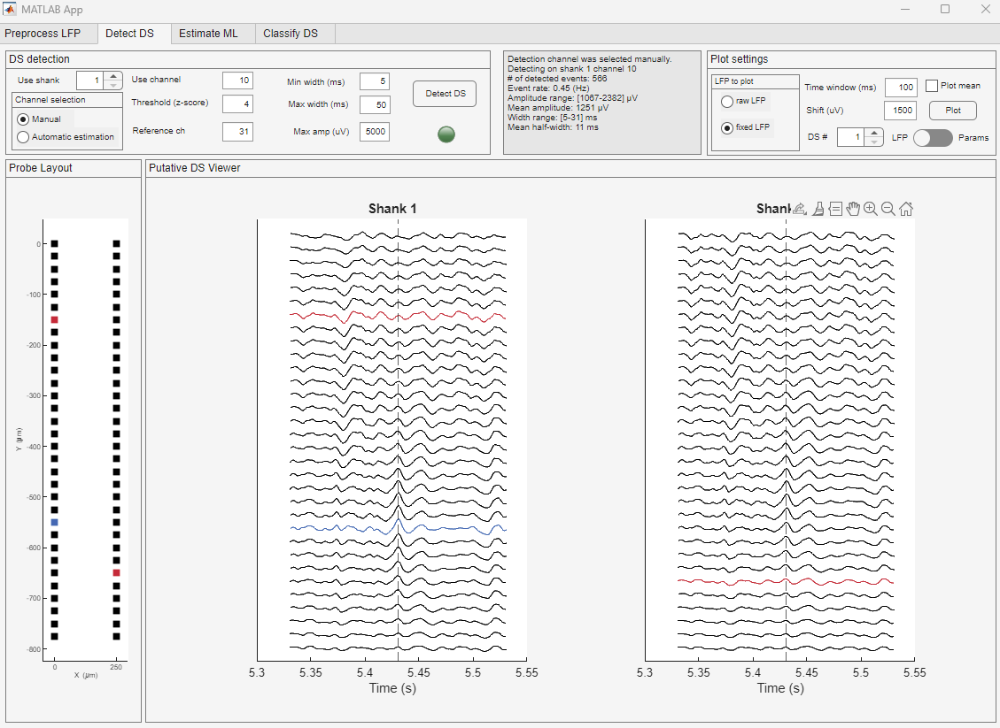
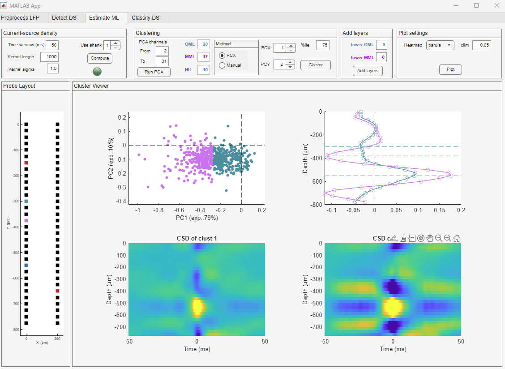
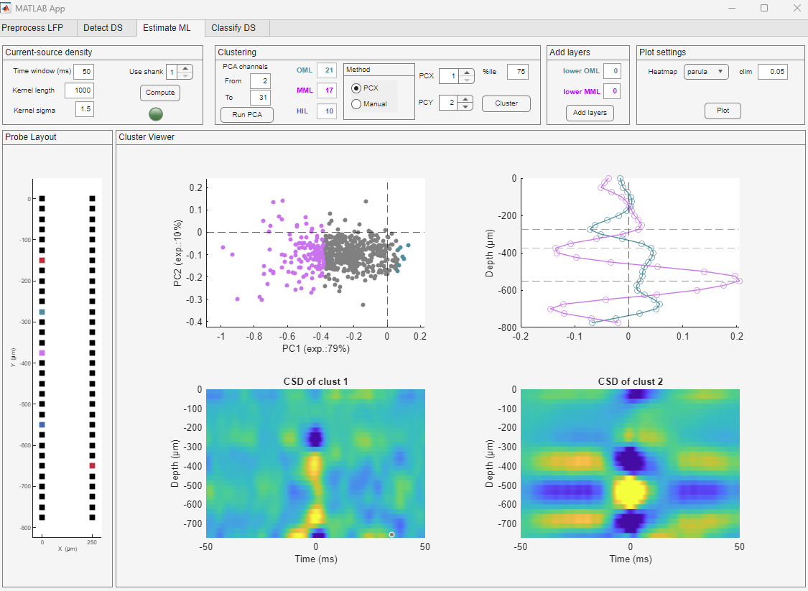
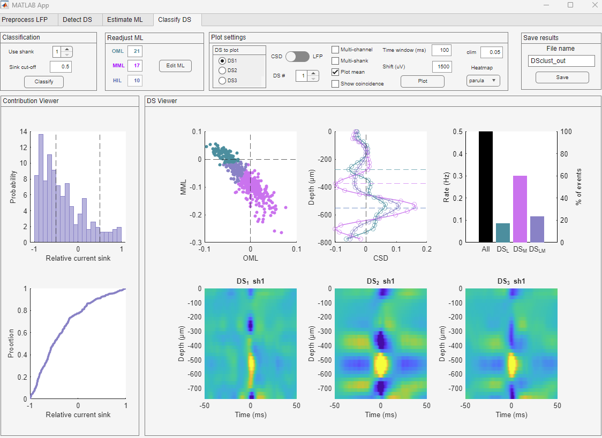

# Dentate Spike Interface 

GUI was tested on 10/27/2025 in MATLAB R2025a.
(Ewell lab, Gergely Tarcsay)

## Test data 
The test data is currently available at , containing two *.mat files: an LFP file and a config file with the following parameters:
* sampling rate
* channel map
* x coordinates
* y coordinates
* spacing
* probe type (optional)
* recording system (optional)

Details: Recordings with Cambridge Neurotech, H2 (double shank); channels are organized in the LFP file; fs = 2 kHz (Ewell lab)

Data is available at *Tarcsay, Gergely; Saxena, Rajat; Long, Royston; Shobe, Justin L.; McNaughton, Bruce L.; Ewell, Laura A. (2025), “Dentate spikes comprise a continuum of relative input strength 
from the lateral and medial entorhinal cortex”, Mendeley Data, V1, doi: 10.17632/grcn2dd9st.1 - TestData folder*

## Interface pipeline
After downloading the Interface directory from GitHub, add the folder to MATLAB's path. When running on your own data, make sure to create a configuration file containing the details specified above. As reference, please see config files in the test data set.

### 1. Loading the data
The interface expects two input files that are located in the same folder: 1) a file (.mat) containing the LFP data (downsampling recommended to 1-2 kHz) and 2) a configuration file (.mat) with channel map, probe geometry specifications and LFP sampling rate. Press the **Load data** button and select your data. Upon loading data, LFP is filtered in the 10 - 200 Hz range that can be adjusted by the user. 
Note that in the **Plot settings** panel the time window (*t0*/*t1*) and distance between channels (*Shift*) can be set.

### 2. Fixing flat channels
LFP should be inspected on all channels and flat channels may be fixed in the *Fixed dead channels* panel. 
Recommended manual option. Use the **Shank** and **Channel** toggles to navigate to a given channel. In the *Label selected* subpanel, click on the *Dead* option. When all flat/dead chanels has been selected, press the **Fix channels** button. 

Automatic option (slower): Note that flat channels can be automatically detected in the window by calculating the Pearson’s coefficients of the N first neighbors. Press the **Detect** for automatic estimation of broken channels. Parameters: # of neighbors (neighboring channels which to compare each channel) and similarity threshold (correlation coefficient of 0.85 or higher are considered similar channel, below that a channel differs from its neighbor).

In this example, two channels were fixed using the manual option. Fixed channels are marked in red color, currently selected color is marked in yellow.

### 3. Detecting dentate spikes
Click on the *Detect DS* tab. Select the shank to be used for detection and channel (*Use channel*). Note that channel can be automatically estimated when *Automatic estimation* is selected in the *Channel selection* subpanel. Set z-score threshold, minimum/maximum width and maximum amplitude of detected events. Select a reference channel outside the DG - events detected on the two channels in a coincidence are discarded. When left on 0, no reference channel will be used. Press the **Detect DS** button.

Channel used for detection are marked in blue. Detected events and parameters are displayed in the text field. In the plot settings, time window and distance between channels can be set. Toggle between individual events using the **DS #** button. For individual waveform, select the *Plot mean* option. To display parameters (distribution of amplitude, width and inter-trial-interval; mean marked by dashed line), swithch from *LFP* to the *Params* option. Time of the DS corresponds to the time of the peak.

In this example, dentate spikes were detected on shank 1. 

### 4. Locating the outer and middle molecular layers
Press the **Compute** button in the *Current-source density* panel to calculate the CSD across all channels on a given shank. By default, CSD is calculated +/- 50 ms around the peak of DSs. CSD is smoothed using a gaussian kernel with a half-width of 1.5 channels (*Kernel sigma*) by default.

Next, press the **Run PCA** button in the *Clustering* panel. In this step, PCA is performed on the CSD measured at the peak of the DS on selected channels (*PCA channels*, by default each channel is used except the most superficial and the deepest). Events are mapped into the PC1-PC2 space. K-means clustering is performed on the events by default, however, the outer and the middle molecular layers (oml/mmml) are not separated with this method (use the upper right panel to visually inspect the CSD of the two clusters). 

To locate the oml and mml, select the **PCX** method in the *Method* subpanel and press **Cluster**. In this method, events with the most negative and most positive values along PC-X axis (PC1 by default). To include fewer or more events, change the **%ile value** (default by 75, meaning that the 25% most negative and 25% most positive values are kept only). 

Use the **Manual** method, when 1) the **PCX** method does not give a sufficient result or there are no positive/negative PC1 values. This allows a manual clustering by having the user drawing polygons to select two subsets of events.

If oml/mml channels can be identified in the lower blade, set the channels manually in the *Add layers* panel.

### 5. DS classification
Press the **Classify** button in the *Classification* panel (default is 0.5 cut-off of relative current sink score). Use the top, middle panel in the *DS Viewer* to inspect the current-sink profile for each DS type (cyan - DS1, magenta - DS2, purple - DS3). If oml/mml layers need to be modified, use the *Readjust ML* field and then press **Classify** again.

Visualization option. By default the followings are displayed:
top, left: DS represented in the OML-MML CSD space
top, middle: CSD profile across channels @ DS peak for each type
top, right: rate and proportion of each DS type
bottom: mean CSD profile for DS1-DS3

To plot individual DS events, uncheck the **Plot mean** option in the *Plot settings* panel. Select the type of DS in the **DS to plot** box. Toggle on individual events using the **DS #**. 
To show LFP, switch to the **LFP** option with the toggle.
To show LFP/CSD for every shank, select the **Multi-shank** option.
To show the temporal dynamics of the CSD in the oml/mml, select the **Show coincidence** option.
To change the max/min color value for the CSDs, use the **clim** field.

### 6. Saving and output file.
Press the **Save button** in the *Save results* panel with a specified file name. The file contains the following variables:

1. Use for downstream analysis
   
*Classify results* : numbers shanks used for analysis x  1 cell. Each cell element contains a struct with the followings: 
* DS type (1 2 3, noise is considered as NaN)
* OML/MML: CSD @ DS peak in oml/mml respectively
* score: relative current sink calculated on each DS that has current sink both in oml/mml
* cut_off: threshold use to define DS3s. Score between +/- cut_off are considered as DS3. Score > cut_off are DS1, Score < cut_off are DS2

*CSD*: numbers shanks used for analysis x  1 cell. Each cell element is a 4-D object with the following specifications:
number of channels x time window x number of dentate spikes x number of shanks.

Example for a multi-shank case:
CSD{1}: contains the CSD profile across channels and for each shank, around each DS detected on shank 1
CSD{2}: contains the CSD profile across channels and for each shank, around each DS detected on shank 2

*DS_struct*: numbers shanks used for analysis x  1 cell. Each cell element contains a struct related to DS detection.
* channel: channel used for detection
* amp: amplitude/width/prominence of each DS
* time: timestamp of DS peak (measured in sample point)
* timeMS: timestamp of DS peak (measured in ms)
* clust_idx: indices of initial clustering; not meaningful for downstream analysis

*DG_layers* numbers shanks used for analysis x  1 cell. Each element contains a vector:
DG_layers{1}(1): channel of oml
DG_layers{1}(2): channel of mml
DG_layers{1}(3): -1
DG_layers{1}(4): channel of mml in the lower blade; -1 if not specified
DG_layers{1}(5): channel of oml in the lower blade; -1 if not specified

2. Details of the classification analysis; only for additional information

*probe*: a struct containing specifications of the probe (based on the config file)

*params*: parameters used for filtering; DS detection and clustering

*PCA results*: pca parameters; output from pca() built-in function. PCA.in: input for pca, CSD @ DS peak for each event across channels. PCA.idx: contains the indices of used DSs to determine the location of oml/mml (1 or 2; 0 if not used). Each cell element represent a shank that was used for the analysis.

*Classification_raw*: contains a raw classification in which the relative current sink thresholding has not been applied yet.
   

   
